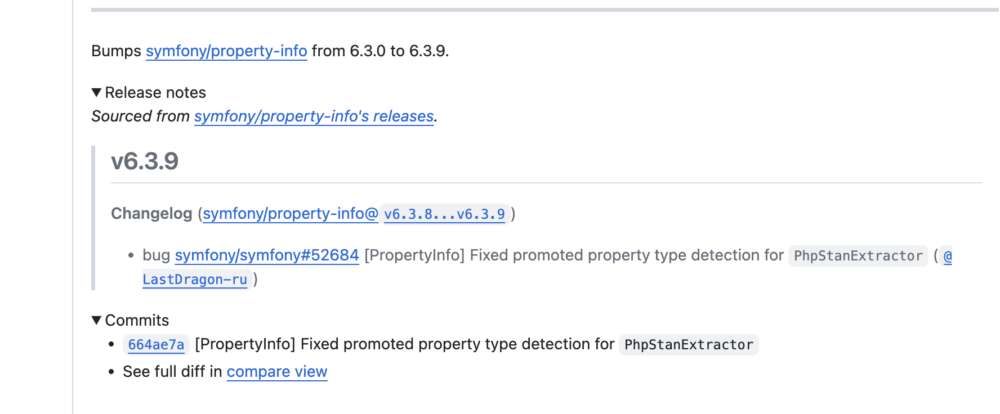

There comes a time in every project where you wonder if your dependencies are up-to-date. If you're working on a 
professional project, then it is often the case you are legally obligated to make sure the dependencies are 
up-to-date and secure. If you're working on a personal project, however, keeping things current can be a barrier
to accomplishing anything, and it is quite common to let things slide.

But you don't have to fuss with updates when Dependabot has your back. Dependabot is an automated dependency checker
that can make pull requests against your codebase at a certain frequency with plenty of rules for further
customization. 

It works on GitHub, where I host my code, so I am only going to discuss automated dependency updates on GitHub, but
I'm sure GitLab and other code hosting platforms have similar solutions.

## Initial Configuration

There isn't much you need to do to add Dependabot updates to a project. For my project I am using PHP but also 
sometimes have some JS dependencies thrown in. At a bare minimum, you only need to define three things for
Dependabot to start doing its job. 

- package-ecosystem - Which package manager are you using? For me, it is `composer`
- directory - Where is your package information? For me and most people it is at the root.
- schedule.interval - How often should Dependabot look for updates? This can differ depending on your needs.

I generally only use these three configuration options, but I will get into some more detailed configuration
later in this post.

After [reading the docs](https://docs.github.com/en/code-security/dependabot/dependabot-version-updates/configuration-options-for-the-dependabot.yml-file) 
for a little while, I generated this file and put it at `.github/dependabot.yml` in my codebase.

```yaml
version: 2
updates:
  - package-ecosystem: "composer"
    directory: "/"
    schedule:
      interval: "daily"
    open-pull-requests-limit: 10
  - package-ecosystem: "npm"
    directory: "/"
    schedule:
      interval: "daily"
    open-pull-requests-limit: 10
```

Almost immediately after I uploaded my new commit, I saw many dependency updates. This is why the 
`open-pull-request-limit` option can be handy if you don't want to deal with too many dependency updates at once.

You can also change the frequency to `weekly`, but remember that will likely make you have to review more updates
each time Dependabot runs its check. You'll likely have to play around with the settings to get your desired cadence, 
but at least this is better than manually checking yourself.

## Release Notes

While I could try `composer outdated` to show me what I likely should update, one of the advantages of using Dependabot
is that it shows you the release notes and commits right there on GitHub.



It would take me some time to find the release notes if I wanted to scan a list of outdated dependencies, and I would have
to look up each one to check. Granted, I don't really read the release notes

## Security Updates


## Automating the Updates

## Commit Cred Inflation Bonus

Once you get good at clicking the merge button, or have automated the checks and merging in of Dependabot updates,
you'll start to notice that 

Does the automated way still preserve the commits since you aren't merging them in?

## Caveats

There are some caveats to be aware of when using Dependabot. 

I don't think it will show you updates to major versions if your package management file has version constraints tied
to a minor version, which most projects will have. Sometimes, you might only want to update the patch version and 
leave minor version updates out all together. It just depends on how you add dependencies to your projects.

